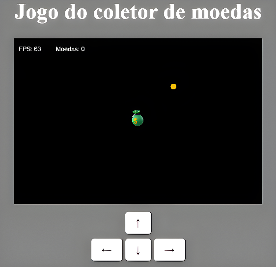

# Coin-Collecting-Game
 **My first Web Game using HTML-CSS-JS**, this is a singleplayer game 

Currently this project is in beta phase in its version 1.0,
This is a lab project aimed at honing my skills, so there may be no updates

Developed by Cristian Vieira with knowledge acquired in the course "Game Development with JS" by Sololearn, available at [Sololearn.com](https://www.sololearn.com) 

### User Guide:
**Objective**: The object of the game is to collect as many coins as possible.

**How to play**: To move the collector towards the coins, use the arrow keys **( ↑↓ ← → )** to define the direction the collector should follow

view the project image:

  

### Possible future  updates:
- [ ] Generate obstacles for the collector as the coins are collected, in case the collector collides with the objects presents Game Over on the screen
- [ ] Button to restart the game
- [ ] Create a record ranking of points from previous matches

---

## Descrição em PT-BR:

**Meu primeiro Web Game usando HTML-CSS-JS**, este é um jogo singleplayer

Atualmente este projeto está em fase beta em sua versão 1.0,
Este é um projeto de laboratório com objetivo de aprimorar minhas habilidades, então pode não haver atualizações

Desenvolvido por Cristian Vieira com conhecimentos adquiridos no curso "Game Development with JS" da Sololearn, disponível em [Sololearn.com](https://www.sololearn.com) 

### Manual do usuário:
**Objetivo**: O jogo consiste em coletar o maior número de moedas possível 

**Como jogar**: Para mover o coletor em direção as moedas use as setas do teclado **( ↑↓ ← → )** para definir a direção que o coletor deve seguir

### Futuras possiveis atualizações:
- [ ] Gerar obstaculos para o coletor conforme as moedas forem coletadas, caso coletor colida com os objetos apresentar Game Over na tela
- [ ] Botão para recomeçar o jogo
- [ ] Criar um ranking de recorde de pontos das partidas anteriores

